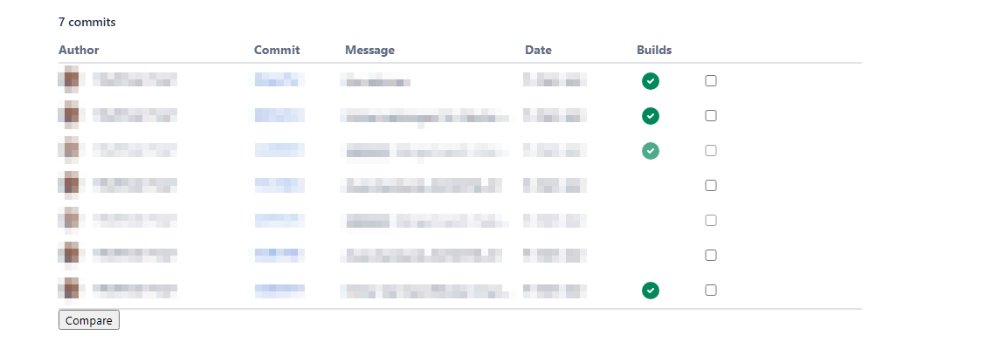

Adds the functionality to diff commits in the Bitbucket Pullrequest view. Select two commits and click on the compare button.

To install, open this link `https://github.com/DirkHeinke/bitbucket-diff-commit-pr/raw/master/dist/bundle.user.js` with installed [Tampermonkey](https://www.tampermonkey.net/).

Based on [rollup-userscript-template](https://github.com/cvzi/rollup-userscript-template)

## Development

Run `npm run serve`

Release `npm run build`
